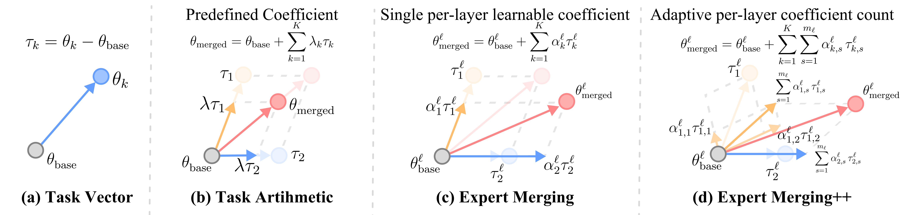

# Expert Merging
<p align="center">
  💻 <a href="https://github.com/Littleor/ExpertMerging"><b>Code</b></a>&nbsp&nbsp | &nbsp&nbsp📄 <a href="https://arxiv.org/abs/2509.25712"><b>Paper</b></a>
</p>

Official implementation of Expert Merging. This project learns to combine multiple domain-specialized expert LLMs into a single LLMs via Unsupervised Expert Alignment and Importance-Guided Layer Chunking.


<!--  -->

## Getting Started

### 1. Clone the repository
```bash
git clone https://github.com/Littleor/ExpertMerging.git
cd ExpertMerging
```

### 2. Create and activate an environment
```bash
conda create -n expert-merging python=3.10 -y
conda activate expert-merging
pip install -U pip
pip install -r requirements.txt
```

### 3. Download pretrained experts
Follow the checkpoint download guide from [WalkerWorldPeace/MLLMerging](https://github.com/WalkerWorldPeace/MLLMerging/). ExpertMerging expects the same base model and task experts with the identical folder layout, so you can place the downloaded directories under a cache path of your choice (e.g., `/mnt/data/cache`). Either pass `--cache_dir /mnt/data/cache` when running the CLI or update `.env` to include `CACHE_DIR="/mnt/data/cache"`.

### 4. Prepare data
In our implementation, we use a JSON-formatted dataset for training. 
To create the dataset, make a directory (e.g., `dataset/`) and add one JSON file per task (`${task_name}.json`). Each file should contain a list of objects with the following fields:

```json
[
  {
    "image_path": "path/to/image.jpg", // absolute or relative path
    "question": "Describe what is in the image.",
    "response": "...", // optional, fake labels generated by the experts
    "question_id": 0,
    "task_name": "GQA"
  },
  {
    "image_path": "path/to/another.jpg",
    "question": "What digit is visible?",
    "question_id": 1,
    "task_name": "GQA"
  }
]
```

## Quickstart

### Run Expert Merging
```bash
cd InternVL
python model_merging.py \
  --method expert_merging \
  --cache_dir /mnt/data/cache \
  --data_dir ../dataset
```


### Try alternative merging baselines
Switch `--method` to any of the supported algorithms without changing the rest of the command:
```
task_arithmetic | ties | dare_ta | dare_ties | iso | svd | svd_intermediate | wudi | wudi2 | weight_average
```
Each run writes outputs to `results/logs/<method>/<run_name>/`.

## Outputs and Logging
- `results/logs/<method>/<run_name>/merge.log` collects rich-formatted logs (console + file).
- `results/logs/<method>/<run_name>/config.json` records all CLI arguments with a timestamp.
- `results/logs/<method>/<run_name>/model/` stores the merged checkpoint and tokenizer.
- TensorBoard logs for Expert Merging live under the same directory (created by `accelerate`).

## Evaluation
We rely on the evaluation harness from [WalkerWorldPeace/MLLMerging](https://github.com/WalkerWorldPeace/MLLMerging/) to reproduce benchmark metrics. After producing a merged checkpoint, follow their evaluation README to run quantitative comparisons on the shared datasets.

### Known Issues For `MLLMerging` Repository
- `MLLMerging` has a bug for evaluating `InternVL` models, because of the saved model checkpoint lacking some `.py` files. To fix this, copy `${CACHE_DIR}/InternVL2_5-1B/*.py` to the saved model directory.


## Citation
If you use this repository, please cite our arXiv preprint:
```
@article{zhang2025expert,
  title={Expert Merging: Model Merging with Unsupervised Expert Alignment and Importance-Guided Layer Chunking},
  author={Zhang, Dengming and Ma, Xiaowen and Ni, Zhenliang and Wu, Zhenkai and Shu, Han and Jiang, Xin and Chen, Xinghao},
  journal={arXiv preprint arXiv:2509.25712},
  year={2025}
}
```

## Acknowledgements
Our implementation builds on the open-source contributions of [WalkerWorldPeace/MLLMerging](https://github.com/WalkerWorldPeace/MLLMerging/). We thank the authors for releasing checkpoints, datasets, and baseline code that made this project possible.